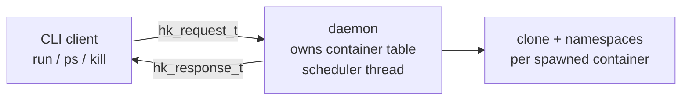
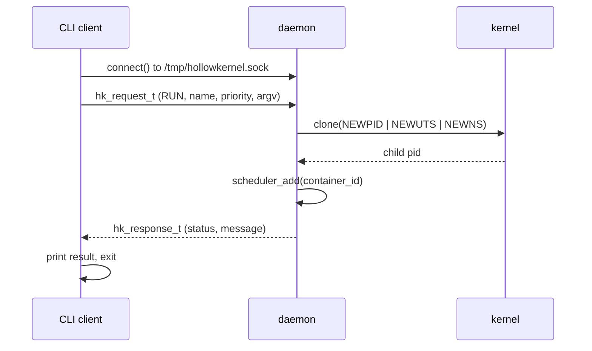
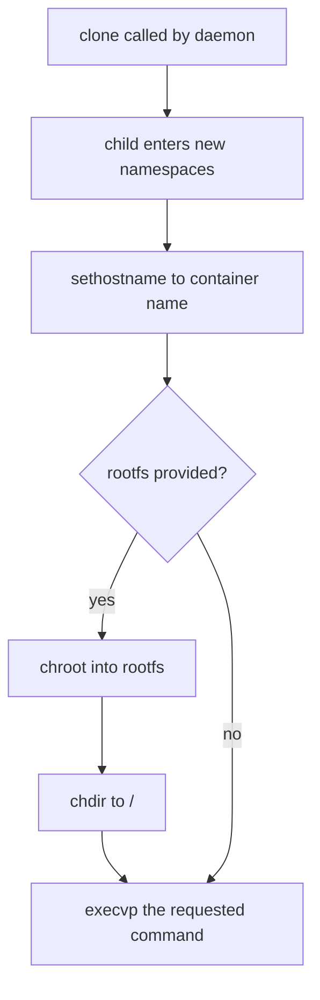
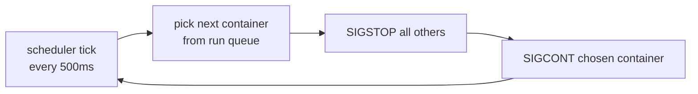
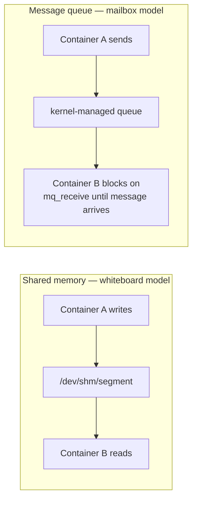
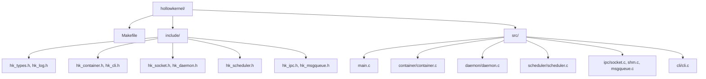

# hollowkernel

A user-space container runtime built from scratch in C — implementing process isolation, a custom priority scheduler, inter-process communication, and filesystem isolation using real Linux kernel primitives. No libcontainer, no runc, no external runtime dependencies. Just syscalls.

Think of it as a minimal, educational reimplementation of what `dockerd` does under the hood.

---

## Why this exists

Most developers use Docker without ever seeing what's underneath. hollowkernel is the answer to "what if I built that myself?" — using the same fundamental mechanisms real container runtimes are built on: `clone()`, Linux namespaces, Unix domain sockets, POSIX IPC, and `chroot()`.

Built as a systems programming deep-dive and portfolio project, targeting infrastructure and platform engineering roles.

---

## Architecture

hollowkernel runs as a **daemon/client pair**, the same split used by `dockerd` and the `docker` CLI:



The client builds a request, sends it over a Unix socket, and the daemon — a long-running background process — does the actual work and persists state in memory. This solves the core problem of one-shot CLI tools: without a daemon, every invocation starts with a blank slate and `ps` can never show what a previous command spawned.

**Request lifecycle** — what happens when you run `hollowkernel run web 5 -- /bin/sh`:



**Container internals** — what the cloned child does before it becomes the user's process:



---

## What's implemented

### Phase 1 — Container runtime
- Process isolation via `clone()` with `CLONE_NEWPID`, `CLONE_NEWUTS`, and `CLONE_NEWNS`
- Each container gets its own PID namespace (it sees itself as PID 1), its own hostname, and its own mount namespace
- Daemon/client architecture over Unix domain sockets (`/tmp/hollowkernel.sock`) with a fixed-size binary request/response protocol
- CLI commands: `run`, `ps`, `kill`, `daemon`

### Phase 2 — Custom priority scheduler
- A background `pthread` fires a scheduling tick every 500ms, independent of the daemon's accept loop
- CPU time is distributed using `SIGSTOP`/`SIGCONT` — the scheduler freezes every container except the one currently selected, then resumes it
- Two algorithms: round robin (equal turns) and priority-weighted (a container with priority *N* gets *N+1* slots in the run queue, so higher-priority containers get proportionally more ticks)



### Phase 3 — Inter-container IPC
- **Shared memory** (`shm_open` + `mmap`) — a named segment under `/dev/shm` that any container can write to or read from with zero copying. Fast, but no ordering and no blocking.
- **POSIX message queues** (`mq_open`/`mq_send`/`mq_receive`) — an ordered, priority-aware mailbox. `mq_receive` genuinely blocks the calling process until a message arrives, verified across two separate terminal sessions.



### Phase 4 — Filesystem isolation
- `chroot()` + `chdir("/")` inside the cloned child, before `execvp`, jailing the container into a minimal busybox-based root filesystem
- Verified: `ls /` inside a running container returns only the container's own directories — none of the host's filesystem is visible
- CLI flag: `run <name> [priority] --rootfs <path> -- <cmd> [args...]`

---

## Build

Requires Linux (kernel ≥ 3.8 for namespace support; developed and tested on WSL2 with kernel 6.6). GCC 13, no external dependencies beyond `pthread` and `rt`.

```bash
make
```

## Usage

```bash
# Start the daemon (requires root — namespace creation needs CAP_SYS_ADMIN)
sudo ./build/hollowkernel daemon

# Spawn an isolated container
sudo ./build/hollowkernel run web 5 -- /bin/sh

# Spawn a container jailed into a custom rootfs
sudo ./build/hollowkernel run jailed 5 --rootfs ./rootfs -- /bin/sh -c "ls /"

# List all containers and their state
sudo ./build/hollowkernel ps

# Kill a container by id
sudo ./build/hollowkernel kill 1

# Shared memory IPC (no root required)
./build/hollowkernel shm-write greeting "hello between containers"
./build/hollowkernel shm-read greeting

# Message queue IPC — mq-receive blocks until a message arrives
./build/hollowkernel mq-receive orders
./build/hollowkernel mq-send orders "build container 1" 5
```

---

## Project layout



| File | Responsibility |
|---|---|
| `include/hk_types.h` | container descriptor, lifecycle states, return codes |
| `include/hk_log.h` | coloured logging macros |
| `include/hk_container.h` | container manager API |
| `include/hk_cli.h` | CLI dispatcher API |
| `include/hk_socket.h` | daemon/client wire protocol |
| `include/hk_daemon.h` | daemon start + client send API |
| `include/hk_scheduler.h` | scheduler API (round robin / priority) |
| `include/hk_ipc.h` | shared memory API |
| `include/hk_msgqueue.h` | message queue API |
| `src/main.c` | entry point, root check for daemon mode |
| `src/container/container.c` | clone(), namespaces, chroot, container table |
| `src/daemon/daemon.c` | Unix socket server, accept loop, scheduler thread |
| `src/scheduler/scheduler.c` | SIGSTOP/SIGCONT run-queue scheduling |
| `src/ipc/socket.c` | reliable send/recv over sockets |
| `src/ipc/shm.c` | shared memory write/read/destroy |
| `src/ipc/msgqueue.c` | message queue send/receive/destroy |
| `src/cli/cli.c` | command parsing, request building |

---

## What I personally debugged

A few of the non-obvious failures hit while building this — the kind that don't show up in tutorials:

- **`_GNU_SOURCE` redefinition** — defining it both in the file and via `-D_GNU_SOURCE` in the Makefile caused warnings; resolved by keeping it solely in the build flags.
- **Daemon output vanishing** — after `setsid()` detaches the daemon from its controlling terminal, all `stdout`/`stderr` output silently disappears. Fixed by `dup2()`-ing both to a log file before detaching.
- **Silent `chroot()` write failures** — file writes inside a chrooted container failed with no error because the minimal rootfs was missing a `/tmp` directory; the write was being resolved relative to the jail, not the host.
- **Function signature mismatches across the daemon/client boundary** — adding a `rootfs` parameter to `hk_container_run()` required updating the header, every call site, and the wire protocol struct in lockstep; the compiler caught every mismatch before runtime.

---

## Roadmap

| Phase | Feature | Status |
|---|---|---|
| 1 | Container spawn via namespaces + daemon/CLI | Done |
| 2 | Priority scheduler (SIGSTOP/SIGCONT) | Done |
| 3 | IPC — shared memory + message queues | Done |
| 4 | Filesystem isolation via chroot() | Done |
| 5 | Resource limits via cgroups (CPU/memory caps) | Planned |
| 6 | Container networking (veth pairs) | Planned |
| 6 | `pivot_root()` for stronger filesystem isolation | Planned |

---

## Tech

- **Language:** C11 (`-std=c11 -D_GNU_SOURCE`)
- **OS:** Linux (kernel ≥ 3.8 for namespaces)
- **Key syscalls / APIs:** `clone`, `fork`, `execvp`, `waitpid`, `kill`, `setsid`, `sethostname`, `chroot`, `chdir`, `socket`/`bind`/`listen`/`accept`, `pthread_create`, `shm_open`/`mmap`, `mq_open`/`mq_send`/`mq_receive`
- **Build:** GNU Make with automatic source discovery — new `.c` files under `src/` are picked up without editing the Makefile